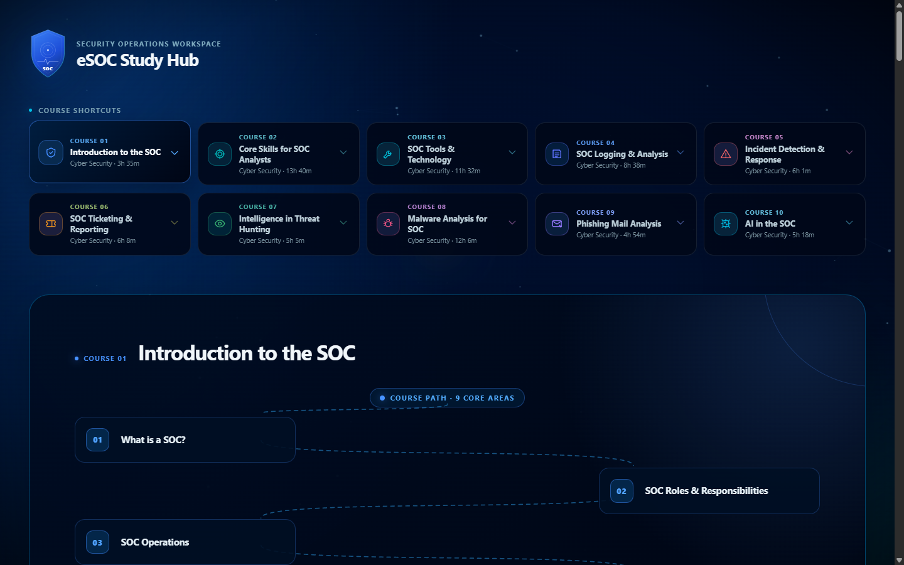
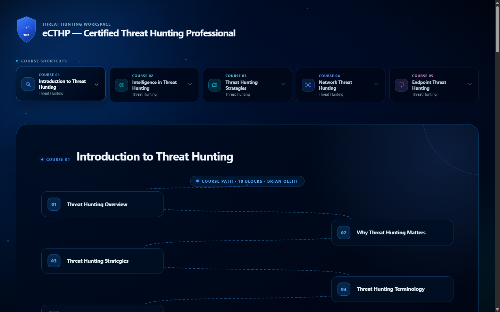

# CyberSecurity Study Hubs — Executive Defense & Threat Hunting Architecture

<p align="center">
  <a href="https://tooshy2.github.io/CyberSecurity-Study-Hubs/"></a>
  <a href="https://tooshy2.github.io/CyberSecurity-Study-Hubs/eSOC.html"></a>
  <a href="https://tooshy2.github.io/CyberSecurity-Study-Hubs/eCTHP.html"></a>
  <a href="LICENSE"></a>
  <a href="#-academic--security-disclaimer"></a>
  <a href="https://ine.com/"></a>
</p>

<p align="center">
  <strong>A synchronized, client-side cybersecurity knowledge portal bridging Reactive SOC Operations (Tier-1 / eSOC) and Proactive Enterprise Threat Hunting (eCTHP).</strong>
</p>

---

## ⚡ Direct Quick Access & Live Demos

| 🌐 **Main Executive Portal** | 🛡️ **eSOC Live Workspace** | 🎯 **eCTHP Live Workspace** |
| :--- | :--- | :--- |
| Unified Command Center & Matrix | Reactive Defense & Incident Triage | Proactive Threat Hunting & Forensics |
| [👉 Launch Executive Portal](https://tooshy2.github.io/CyberSecurity-Study-Hubs/) | [👉 Launch eSOC Workspace](https://tooshy2.github.io/CyberSecurity-Study-Hubs/eSOC.html) | [👉 Launch eCTHP Workspace](https://tooshy2.github.io/CyberSecurity-Study-Hubs/eCTHP.html) |

---

## 📑 Table of Contents

- [Executive Overview & Dual Strategy](#-executive-overview--dual-strategy)
- [Architecture & Curriculum Map](#-architecture--curriculum-map)
  - [1. Security Operations (Reactive Defense — eSOC)](#1-security-operations-reactive-defense--esoc)
  - [2. Threat Hunting (Proactive Adversary Hunting — eCTHP)](#2-threat-hunting-proactive-adversary-hunting--ecthp)
- [Visual Previews & Workspaces](#-visual-previews--workspaces)
  - [eSOC Study Hub Live Workspace](#esoc-study-hub-live-workspace)
  - [eCTHP Study Hub Live Workspace](#ecthp-study-hub-live-workspace)
- [Repository Structure](#-repository-structure)
- [Core Capabilities & Engineering](#-core-capabilities--engineering)
- [How to Access & Run Locally](#-how-to-access--run-locally)
  - [Option 1: Web Browser Direct (No Setup)](#option-1-web-browser-direct-no-setup)
  - [Option 2: Local HTTP Server (Python)](#option-2-local-http-server-python)
  - [Option 3: Node.js / npx serve](#option-3-nodejs--npx-serve)
  - [Option 4: VS Code Live Server](#option-4-vs-code-live-server)
- [Academic & Security Disclaimer](#-academic--security-disclaimer)
- [License & Credits](#-license--credits)

---

## 🏛 Executive Overview & Dual Strategy

Modern enterprise cyber defense requires seamless synergy between **Reactive Alert Handling** and **Proactive Adversary Hunting**. Relying solely on SIEM alerts creates visibility blind spots, while unfocused hunting without operational baseline telemetry wastes critical analyst hours.

---

## 🗺 Architecture & Curriculum Map

### 1. Security Operations (Reactive Defense — eSOC)
- **Target Certification:** INE Security Operations Certified – Level 1 (`eSOC`)
- **Curriculum Scope:** 10 Comprehensive Courses (76h 57m Total Duration)
- **Primary Operational Focus:**
  * **Log Analysis & SIEM Operations:** Query building in Splunk, Elastic, and KQL; parsing Windows Event Logs (Security, System, Sysmon) and Linux `auditd`/`syslog`.
  * **Alert Triage & Correlation:** Differentiating True Positives from False Positives, noise reduction, and SLA-compliant incident escalation.
  * **Malware & Phishing Analysis:** Header inspection, SPF/DKIM/DMARC verification, static triage of suspicious attachments, and sandbox analysis.
  * **Network Packet Inspection:** Deep-packet triage with Wireshark and `tcpdump`, protocol validation, and TCP stream reassembly.
  * **Incident Detection & Response:** Applying the NIST SP 800-61 / SANS PICERL framework to contain host breaches and preserve evidence.

### 2. Threat Hunting (Proactive Adversary Hunting — eCTHP)
- **Target Certification:** INE Certified Threat Hunting Professional (`eCTHP`)
- **Curriculum Scope:** 5 Advanced Hunting Modules
- **Primary Operational Focus:**
  * **Hypothesis Generation:** Formulating structured hunts based on threat intelligence reports, environmental anomalies, and MITRE ATT&CK® matrix tactics.
  * **Adversary TTP Mapping:** Deconstructing threat actors using the Diamond Model of Intrusion Analysis and the Pyramid of Pain.
  * **Endpoint Hunting & Memory Volatility:** Hunting for process injection (DLL injection, process hollowing, reflective DLL loading), persistence mechanisms, and memory artifacts using Volatility.
  * **Network Threat Hunting:** Uncovering C2 channels, periodic beaconing, DNS tunneling, JA3/JA3S fingerprint anomalies, and HTTP user-agent outliers.
  * **Detection Engineering:** Translating successful hunt discoveries into automated Sigma rules, YARA signatures, and SIEM correlation searches.

---

## 📸 Visual Previews & Workspaces

### eSOC Study Hub Live Workspace
> Comprehensive interactive dashboard featuring shortcut navigation, per-course deep modules, packet analysis syntax, and log triage decision trees.

<p align="center">
  <a href="https://tooshy2.github.io/CyberSecurity-Study-Hubs/eSOC.html">
    
  </a>
</p>

<p align="center">
  <a href="https://tooshy2.github.io/CyberSecurity-Study-Hubs/eSOC.html"><strong>👉 Open eSOC Live Workspace (Full Page)</strong></a>
</p>

---

### eCTHP Study Hub Live Workspace
> Advanced hunting portal providing hypothesis design workflows, memory volatility references, network beacon analysis guides, and persistence checklists.

<p align="center">
  <a href="https://tooshy2.github.io/CyberSecurity-Study-Hubs/eCTHP.html">
    
  </a>
</p>

<p align="center">
  <a href="https://tooshy2.github.io/CyberSecurity-Study-Hubs/eCTHP.html"><strong>👉 Open eCTHP Live Workspace (Full Page)</strong></a>
</p>

---

## 📂 Repository Structure

```text
CyberSecurity-Study-Hubs/
├── .gitignore                      # Git exclusion rules (OS, editor, temp files)
├── LICENSE                         # MIT License + Dedicated Privacy/Security Notice
├── README.md                       # Executive-grade documentation (this file)
├── index.html                      # Unified Command Center & Embedded Viewer Portal
├── eSOC.html                       # Standalone eSOC Study Hub Workspace (1.01 MB)
├── eCTHP.html                      # Standalone eCTHP Study Hub Workspace (435 KB)
├── assets/
│   ├── css/
│   │   └── portal.css              # Dark cyber glassmorphism styles
│   └── images/
│       ├── esoc-preview.png        # Actual high-res screenshot of eSOC workspace
│       ├── ecthp-preview.png       # Actual high-res screenshot of eCTHP workspace
│       ├── esoc-preview.svg        # Scalable vector mockup of eSOC workspace
│       └── ecthp-preview.svg       # Scalable vector mockup of eCTHP workspace
└── hubs/                           # Redundant organized directory (backward compatibility)
    ├── eSOC.html
    └── eCTHP.html
```

---

## ✨ Core Capabilities & Engineering

- **Zero-Dependency Architecture:** 100% native HTML5, modern CSS3, and vanilla JavaScript. Runs anywhere without Node build steps, webpack, or external packages.
- **Embedded Interactive Switcher:** The root portal (`index.html`) embeds both workspaces via responsive iframes with zero scrollbar clipping and fullscreen toggling.
- **High-Contrast Dark Glassmorphism:** Engineered with a unified color token system (`--bg: #090a0f`, `--cyan: #22d3ee`, `--purple: #3b82f6`, `--green: #4ade80`).
- **Offline & Air-Gapped Ready:** Can be cloned to a USB drive or air-gapped lab environment and used immediately with any web browser.

---

## 🚀 How to Access & Run Locally

### Option 1: Web Browser Direct (No Setup)
Simply navigate to the live GitHub Pages portal:
- **Main Portal:** [https://tooshy2.github.io/CyberSecurity-Study-Hubs/](https://tooshy2.github.io/CyberSecurity-Study-Hubs/)
- **eSOC Hub:** [https://tooshy2.github.io/CyberSecurity-Study-Hubs/eSOC.html](https://tooshy2.github.io/CyberSecurity-Study-Hubs/eSOC.html)
- **eCTHP Hub:** [https://tooshy2.github.io/CyberSecurity-Study-Hubs/eCTHP.html](https://tooshy2.github.io/CyberSecurity-Study-Hubs/eCTHP.html)

Or download the repository and double-click `index.html`, `eSOC.html`, or `eCTHP.html`.

### Option 2: Local HTTP Server (Python)
```bash
# Clone the repository
git clone https://github.com/TOOSHY2/CyberSecurity-Study-Hubs.git
cd CyberSecurity-Study-Hubs

# Start local server on port 8080
python -m http.server 8080
```
Browse to `http://localhost:8080/`.

### Option 3: Node.js / npx serve
```bash
npx serve .
```

### Option 4: VS Code Live Server
1. Open the project folder in VS Code.
2. Right-click `index.html` (or `eSOC.html` / `eCTHP.html`).
3. Click **"Open with Live Server"**.

---

## ⚖️ Academic & Security Disclaimer

> [!IMPORTANT]
> **Educational & Fair-Use Notice:**
> - These study hubs and synthesized notes are **independent, personal educational resources** developed by the author for certification preparation, professional competence, and technical reference.
> - All certification titles, course frameworks, and curriculum tracks (`eSOC`, `eCTHP`) are registered trademarks and intellectual property of **[INE Security](https://ine.com/)** (formerly eLearnSecurity). Full academic credit and attribution are extended to INE Security and their instructional staff.
> - **Integrity & Compliance:** This repository contains **NO proprietary examination questions, leaked test dumps, or confidential evaluation material**. All explanations, commands, and workflows represent original syntheses derived from public defensive security documentation and general industry standards.

---

## 📄 License & Credits

- **License:** Distributed under the permissive [MIT License](LICENSE) with an appended Educational & Security Fair-Use rider.
- **Author:** Hasan ([TOOSHY2](https://github.com/TOOSHY2))
- **Training Provider:** [INE Security](https://ine.com/)
