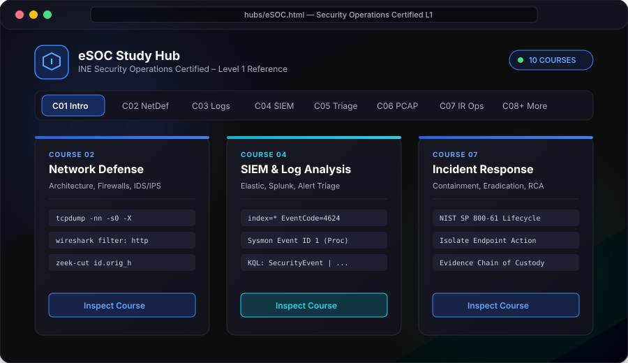
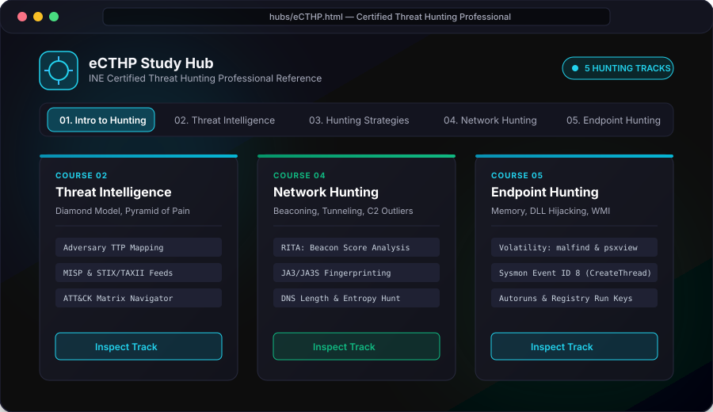

# CyberSecurity Study Hubs — Executive Defense & Threat Hunting Architecture

[](LICENSE)
[](https://pages.github.com/)
[](#academic--security-disclaimer)
[](https://ine.com/)
[](#features--capabilities)

> **Executive Summary:** A synchronized, client-side cybersecurity knowledge portal bridging **Reactive Defensive Operations** (SOC Analyst Level 1 / eSOC) and **Proactive Adversary Hunting** (Certified Threat Hunting Professional / eCTHP). Built as a self-contained, responsive dashboard ready for immediate deployment on GitHub Pages.

---

## 📑 Table of Contents

- [Executive Overview & Architecture](#-executive-overview--architecture)
- [The Dual-Pillar Strategy](#-the-dual-pillar-strategy)
  - [1. eSOC Study Hub (Reactive Defense)](#1-esoc-study-hub-reactive-defense)
  - [2. eCTHP Study Hub (Proactive Threat Hunting)](#2-ecthp-study-hub-proactive-threat-hunting)
- [Repository Structure](#-repository-structure)
- [Features & Capabilities](#-features--capabilities)
- [Local Setup & Deployment](#-local-setup--deployment)
  - [Option A: GitHub Pages (Recommended)](#option-a-github-pages-recommended)
  - [Option B: Local HTTP Server](#option-b-local-http-server)
  - [Option C: VS Code Live Server](#option-c-vs-code-live-server)
- [Academic & Security Disclaimer](#-academic--security-disclaimer)
- [License & Authorship](#-license--authorship)

---

## 🏛 Executive Overview & Architecture

Modern enterprise security operations fail when relying solely on alert-driven monitoring or purely manual hunting without operational baselines. This repository unifies the two complementary halves of defensive engineering into an integrated, interactive knowledge base:

```mermaid
graph LR
    subgraph Portal["Unified Portal: index.html"]
        CC[Command Center Dashboard]
    end

    subgraph Reactive["Pillar 1: Reactive Defense (eSOC)"]
        A1[Alert Ingestion & SIEM] --> A2[Packet & Network Triage]
        A2 --> A3[Host Artifact Analysis]
        A3 --> A4[Incident Containment & Escalation]
    end

    subgraph Proactive["Pillar 2: Proactive Hunting (eCTHP)"]
        H1[Adversary Intelligence / CTI] --> H2[Hypothesis Formulation]
        H2 --> H3[Endpoint & Memory Forensics]
        H3 --> H4[Network Beacon & Anomaly Analysis]
        H4 --> H5[Detection Engineering & Gap Remediation]
    end

    CC -->|Embed / Direct Link| Reactive
    CC -->|Embed / Direct Link| Proactive
    H5 -.->|Feedback Loop: New Rules| A1
```



---

## 🛡 The Dual-Pillar Strategy

### 1. eSOC Study Hub (Reactive Defense)
- **Certification Track:** INE Security Operations Certified – Level 1 (`eSOC`)
- **Scope:** 10 Courses (~77 Hours of Structured Material)
- **Target Role:** Frontline SOC Analyst (Tier 1 / Tier 2)
- **Key Competencies:**
  - Security Information and Event Management (SIEM) query construction and alert triage.
  - Deep packet inspection with Wireshark and `tcpdump`.
  - Endpoint telemetry examination (Windows Event Logs, Sysmon, Linux audit logs).
  - Triage decision trees, false-positive elimination, and incident ticket handling.

### 2. eCTHP Study Hub (Proactive Threat Hunting)
- **Certification Track:** INE Certified Threat Hunting Professional (`eCTHP`)
- **Scope:** 5 Core Hunting Modules
- **Target Role:** Threat Hunter / Senior Incident Responder / Cyber Threat Intelligence Analyst
- **Key Competencies:**
  - Hypothesis formulation leveraging the MITRE ATT&CK® framework and Cyber Threat Intelligence (CTI).
  - Hunting for persistence mechanisms, privilege escalation, and lateral movement.
  - Volatility-based memory analysis and process injection identification.
  - Network baseline anomaly identification, command-and-control (C2) beacon analysis, and DNS tunneling detection.

---

## 📸 Interactive Hub Previews

### eSOC Study Hub (Security Operations Certified – Level 1)
[](hubs/eSOC.html)

### eCTHP Study Hub (Certified Threat Hunting Professional)
[](hubs/eCTHP.html)

---

## 📂 Repository Structure

```text
CyberSecurity-Study-Hubs/
├── .gitignore                   # Standard Web & OS exclusions
├── LICENSE                      # MIT License + Educational Fair-Use Rider
├── README.md                    # Executive Documentation (this file)
├── index.html                   # Command Center Portal & Embedded Viewer
├── assets/
│   ├── css/
│   │   └── portal.css           # Glassmorphism dark-cyber styling
│   └── icons/                   # Shared SVG graphics & vectors
└── hubs/
    ├── eSOC.html                # Interactive eSOC Study Hub (Single-Page App)
    └── eCTHP.html               # Interactive eCTHP Study Hub (Single-Page App)
```

---

## ✨ Features & Capabilities

- **Zero-Dependency Architecture:** 100% pure HTML5, modern CSS, and vanilla JavaScript. Runs offline without build steps or `node_modules`.
- **Integrated Live Hub Viewer:** Seamless embedded view mode with tab switching, allowing instant navigation between eSOC and eCTHP without losing portal state.
- **Glassmorphic Cyber Aesthetic:** Designed with a high-contrast dark theme (`--bg: #090a0f`), subtle radiant haloflows, glowing borders, and crisp typography.
- **Search & Keyboard Navigation:** Each dedicated study hub includes course shortcuts, deep section jumping, and interactive reference tables.
- **Responsive & Clipless:** Optimized layout prevents nested scrollbar issues and clipping across desktop, tablet, and mobile screens.

---

## 🚀 Local Setup & Deployment

### Option A: GitHub Pages (Recommended)
1. Push this repository to your GitHub account:
   ```bash
   git init
   git add .
   git commit -m "feat: initial commit for CyberSecurity-Study-Hubs"
   git branch -M main
   git remote add origin https://github.com/TOOSHY2/CyberSecurity-Study-Hubs.git
   git push -u origin main
   ```
2. In the repository settings on GitHub:
   - Navigate to **Settings** > **Pages**.
   - Under **Build and deployment** > **Source**, select **Deploy from a branch**.
   - Set Branch: `main` / `/ (root)` and click **Save**.
   - Your portal will be live at `https://tooshy2.github.io/CyberSecurity-Study-Hubs/`.

### Option B: Local HTTP Server
Using Python 3:
```bash
# Inside A:\CyberSecurity-Study-Hubs
python -m http.server 8080
```
Then browse to `http://localhost:8080`.

Using Node.js / npx:
```bash
npx serve .
```

### Option C: VS Code Live Server
Right-click `index.html` in VS Code and select **"Open with Live Server"**.

---

## ⚖️ Academic & Security Disclaimer

> [!IMPORTANT]
> **Educational & Fair-Use Notice:**
> - These study hubs and synthesized notes are **independent, personal educational resources** developed by the author for certification preparation and professional reference.
> - All certifications, syllabus frameworks, and course designations (`eSOC`, `eCTHP`) are registered trademarks and proprietary assets of **[INE Security](https://ine.com/)** (formerly eLearnSecurity). Full credit and attribution are extended to INE and their instructional staff.
> - **Compliance & Integrity:** This repository contains **NO proprietary examination questions, leaked test dumps, or confidential evaluation material**. All explanations, commands, and workflows are original syntheses grounded in publicly available cyber defense documentation and general industry standards.

---

## 📄 License & Authorship

Distributed under the **MIT License**. See [LICENSE](LICENSE) for full legal text and permissions.
